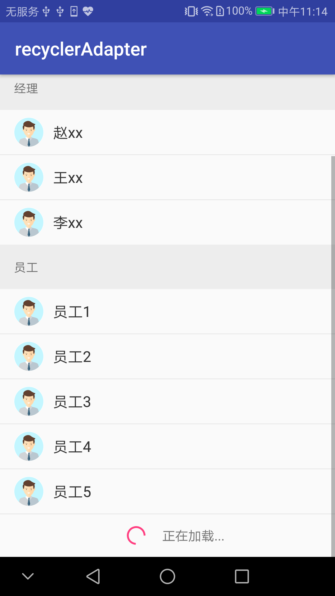
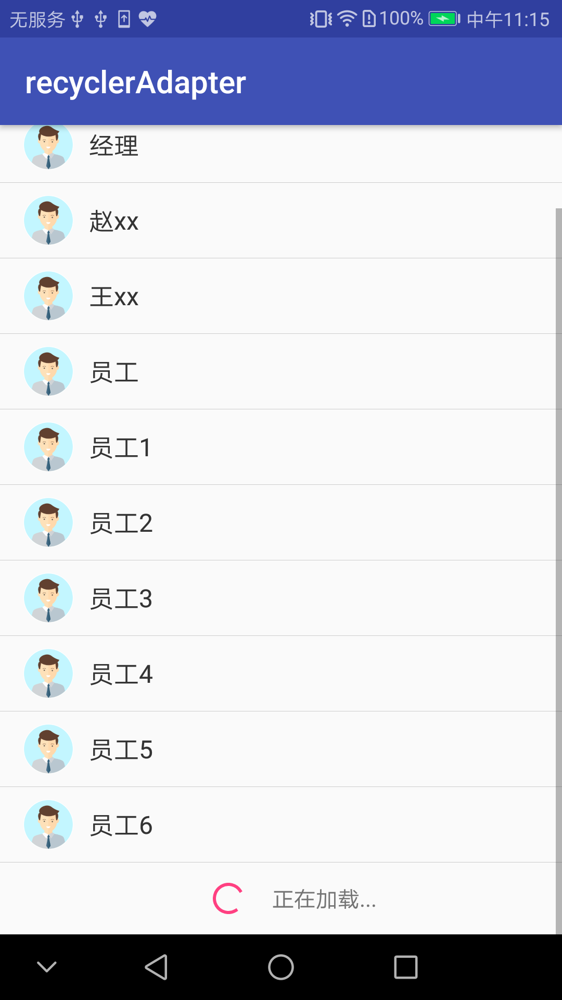

## recyclerAdapter

Android RecyclerView适用的通用adapter，在hongyang 的base-adapter基础上修改一些bug而成,例如加载更多，解决了原项目不满屏自动加载的问题。

## 截图
多布局的情况



单布局的情况



## 使用

基本使用方法参照[https://github.com/hongyangAndroid/baseAdapter](https://github.com/hongyangAndroid/baseAdapter)

本demo提供BaseRecyclerViewActivity基类封装实现加载更多，下拉刷新等功能，使用时继承改类，子类主要实现
```
 public abstract MultiItemTypeAdapter<T> onCreateAdapter(List<T> data);
```
提供自定义的adapter

该基类默认实现`EmptyWrapper`, `HeaderAndFooterWrapper`, `LoadMoreWrapper`

子类可通过需要覆写`getEmptyWrapper`等方法来自定义布局和功能，也可以返回null来屏蔽这些功能

详细具体的使用，请下载源码自行查看
